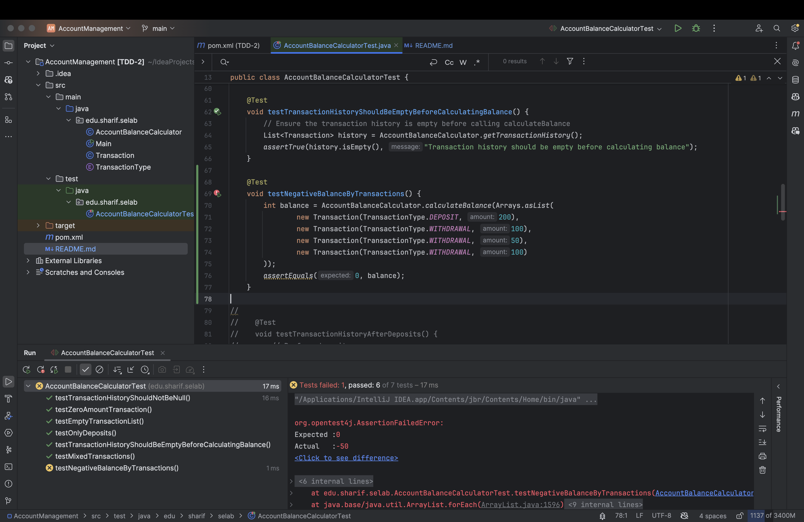
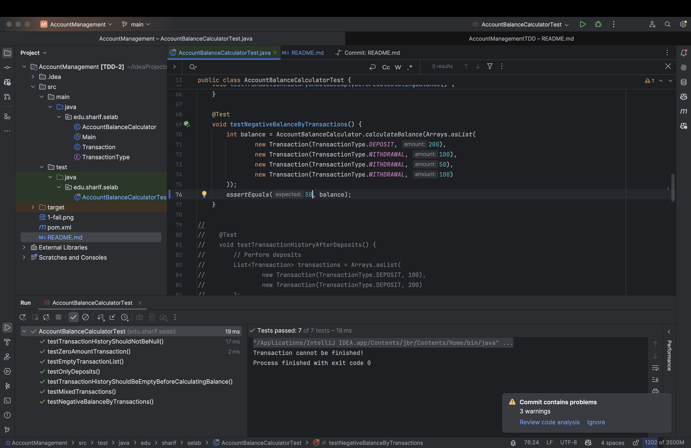
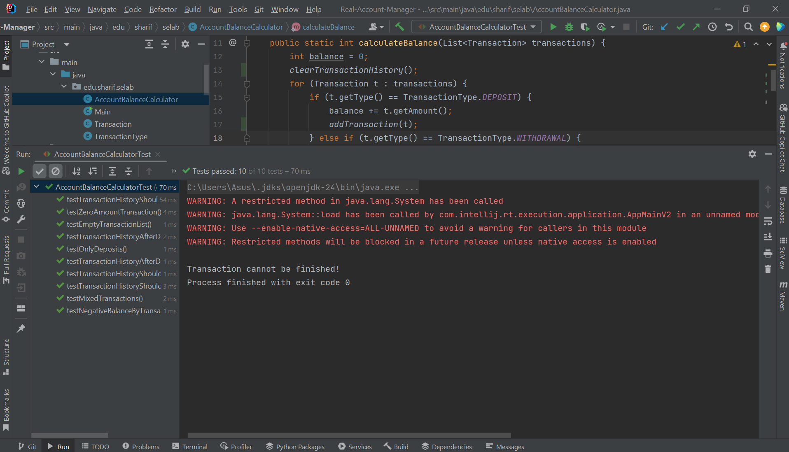

# مدیریت حساب بانکی


# بخش اول

## پرسش اول
در این کد چه خطایی وجود دارد؟ و به نظر شما چرا دیده نشده‌است؟


در این کد، خطایی وجود دارد که اجازه می‌دهد برداشت از حساب حتی زمانی که موجودی کافی نیست انجام شود و منجر به منفی شدن موجودی حساب می‌گردد. این سناریو در تست های فعلی بررسی نشده و برای همین تست ها به درستی پاس می‌شوند و کسی توجهش به خطای موجود جلب نشده است.


## پرسش دوم
پس از یافتن خطا، یک آزمون برای آن بنویسید که منجر به کشف آن خطا شود. سپس آن را به گونه‌ای اصلاح کنید که آن مورد آزمون، پاس شود.

آزمون جدیدی اضافه می‌کنیم که در آن تراکنش‌ها بتوانند موجودی را منفی کنند. در حالت عادی این تست پاس نمی‌شود.




سپس با تغییر کد به صورتی تغییر می‌دهیم که اجازه ندهد موجودی منفی شود و برای این تراکنش ها یک خطا چاپ کند.
```java
public static int calculateBalance(List<Transaction> transactions) {
    int balance = 0;
    for (Transaction t : transactions) {
        if (t.getType() == TransactionType.DEPOSIT) {
            balance += t.getAmount();
        } else if (t.getType() == TransactionType.WITHDRAWAL) {
            if (balance >= t.getAmount()) {
                balance -= t.getAmount();
            } else {
                System.out.print("Transaction cannot be finished!");
            }
        }

    }
    return balance;
}
```

و سپس مشاهده می‌شود که تست جدید ما پاس می‌شود و این خطا برطرف شده است.



## پرسش سوم
به‌نظر شما و بر اساس تجربه‌ی به‌دست آمده، نوشتن آزمون پس از نوشتن برنامه، چه مشکلاتی را می‌تواند بسازد؟

نوشتن آزمون پس از برنامه‌نویسی می‌تواند باعث شود برخی از شرایط بحرانی و خطاهای احتمالی بررسی نشوند.
برنامه‌نویس ممکن است ناخودآگاه تست‌هایی بنویسد که فقط موفقیت کد فعلی را نشان دهند.
در نتیجه، اشکالاتی که در منطق کد وجود دارد ممکن است برای مدت طولانی پنهان بماند و در آینده باعث بروز خطاهای جدی شود. برای مثال در همین حالت سناریو موجودی منفی بسیار خطرناک است و نه تنها کد اشتباه بود بلکه برای این اشتباه تست نوشته شده بود و با پاس شدن تست‌ها ممکن بود با اطمینان یک اشتباه منجر به فاجعه شود.


# بخش دوم

ابتدا تست ها را از کامنت در می‌آوریم و مشاهده می‌کنیم که پاس نمی‌شوند:


برای پاس شدن باید تابع را به گونه ای تغییر دهیم که لیست تراکنش‌ها را بر اساس آخرین محاسبه برگرداند.

```java
public static int calculateBalance(List<Transaction> transactions) {
    int balance = 0;
    clearTransactionHistory();
    for (Transaction t : transactions) {
        if (t.getType() == TransactionType.DEPOSIT) {
            balance += t.getAmount();
            addTransaction(t);
        } else if (t.getType() == TransactionType.WITHDRAWAL) {
            if (balance >= t.getAmount()) {
                balance -= t.getAmount();
                addTransaction(t);
            } else {
                System.out.print("Transaction cannot be finished!");
            }
        }
    }
    return balance;
}
```

با این تغییرات سابقه تراکنش های انجام شده را داریم. تست ها را اجرا می‌کنیم و مشاهده می‌شود تست ها پاس می‌شوند.



## پرسش چهارم

نوشتن موارد آزمون پیش از کدنویسی، چگونه کار ساخت برنامه را (نسبت به روش قبل که در بخش قبل انجام شده) تسهیل کرد؟

نوشتن آزمون پیش از کدنویسی باعث شد که هدف هر قطعه کد از قبل مشخص باشد.
در این روش، ما ابتدا به وضوح می‌دانیم که برنامه باید چه خروجی‌ای تولید کند و چه شرایطی را بسنجد. این موضوع از دوباره‌کاری جلوگیری کرده و باعث شد فقط به اندازه نیاز کد نوشته شود، نه بیشتر.
همچنین با اجرای آزمون‌ها بلافاصله بعد از کدنویسی، سریعاً متوجه می‌شدیم که کجای برنامه درست کار نمی‌کند.

## پرسش پنجم 

به نظر شما، روش ایجاد مبتنی بر آزمون، چه مزایا و معایبی دارد؟ لطفاً بر اساس تجربه‌ای که به این سوال پاسخ دهید.

- مزایا:

  - تمرکز بالاتر در هنگام طراحی و پیاده‌سازی، چون ابتدا شرایط و خروجی مورد انتظار تعریف می‌شود.
  - کدهای تمیزتر و ساده‌تر، چون فقط برای قبولی آزمون‌ها کدنویسی می‌شود.
  - اطمینان بیشتر از درستی عملکرد برنامه در سناریوهای مختلف.
- معایب:

  - در ابتدا زمان‌بر به نظر می‌رسد، به خصوص اگر با این روش آشنا نباشید.
  - اگر آزمون‌ها نادرست یا ناقص نوشته شوند، باعث گمراهی در روند توسعه می‌شود.
  - برای پروژه‌های خیلی سریع یا کدهای موقتی، ممکن است بیش‌ازحد رسمی و زمان‌بر باشد.
