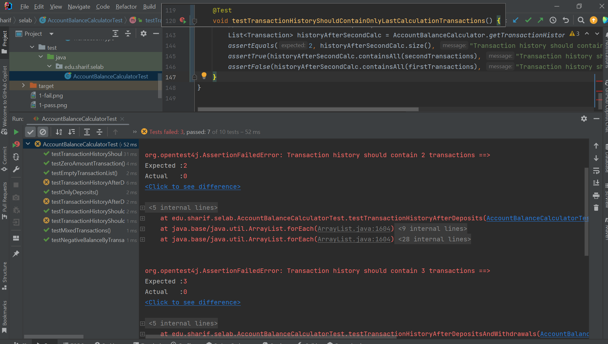

# مدیریت حساب بانکی


# بخش اول

## پرسش اول
در این کد چه خطایی وجود دارد؟ و به نظر شما چرا دیده نشده‌است؟


در این کد، خطایی وجود دارد که اجازه می‌دهد برداشت از حساب حتی زمانی که موجودی کافی نیست انجام شود و منجر به منفی شدن موجودی حساب می‌گردد. این سناریو در تست های فعلی بررسی نشده و برای همین تست ها به درستی پاس می‌شوند و کسی توجهش به خطای موجود جلب نشده است.


## پرسش دوم
پس از یافتن خطا، یک آزمون برای آن بنویسید که منجر به کشف آن خطا شود. سپس آن را به گونه‌ای اصلاح کنید که آن مورد آزمون، پاس شود.

آزمون جدیدی اضافه می‌کنیم که در آن تراکنش‌ها بتوانند موجودی را منفی کنند. در حالت عادی این تست پاس نمی‌شود.


سپس با تغییر کد به صورتی تغییر می‌دهیم که اجازه ندهد موجودی منفی شود و برای این تراکنش ها یک خطا چاپ کند.
```java
public static int calculateBalance(List<Transaction> transactions) {
    int balance = 0;
    for (Transaction t : transactions) {
        if (t.getType() == TransactionType.DEPOSIT) {
            balance += t.getAmount();
        } else if (t.getType() == TransactionType.WITHDRAWAL) {
            if (balance >= t.getAmount()) {
                balance -= t.getAmount();
            } else {
                System.out.print("Transaction cannot be finished!");
            }
        }

    }
    return balance;
}
```

و سپس مشاهده می‌شود که تست جدید ما پاس می‌شود و این خطا برطرف شده است.


## پرسش سوم
به‌نظر شما و بر اساس تجربه‌ی به‌دست آمده، نوشتن آزمون پس از نوشتن برنامه، چه مشکلاتی را می‌تواند بسازد؟

نوشتن آزمون پس از برنامه‌نویسی می‌تواند باعث شود برخی از شرایط بحرانی و خطاهای احتمالی بررسی نشوند.
برنامه‌نویس ممکن است ناخودآگاه تست‌هایی بنویسد که فقط موفقیت کد فعلی را نشان دهند.
در نتیجه، اشکالاتی که در منطق کد وجود دارد ممکن است برای مدت طولانی پنهان بماند و در آینده باعث بروز خطاهای جدی شود. برای مثال در همین حالت سناریو موجودی منفی بسیار خطرناک است و نه تنها کد اشتباه بود بلکه برای این اشتباه تست نوشته شده بود و با پاس شدن تست‌ها ممکن بود با اطمینان یک اشتباه منجر به فاجعه شود.


# بخش دوم

ابتدا تست ها را از کامنت در می‌آوریم و مشاهده می‌کنیم که پاس نمی‌شوند:

